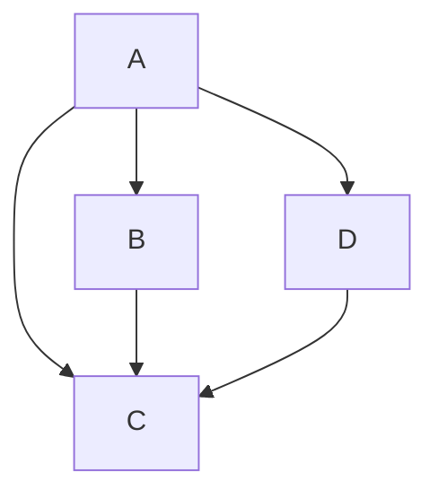
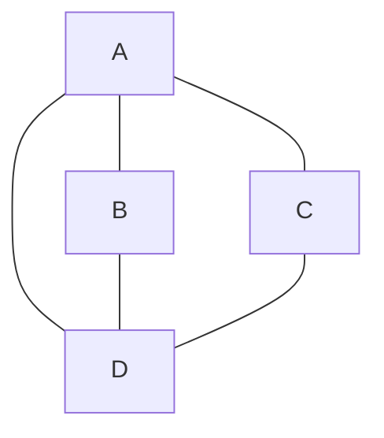
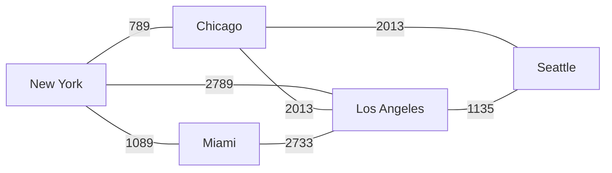
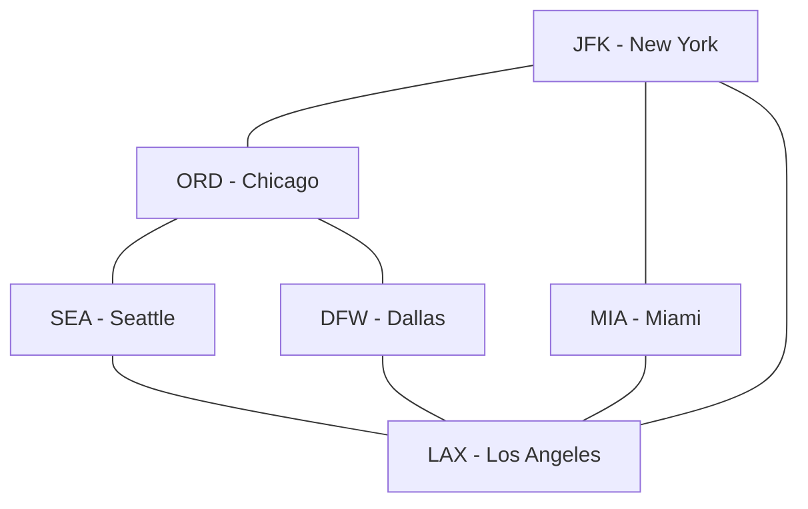
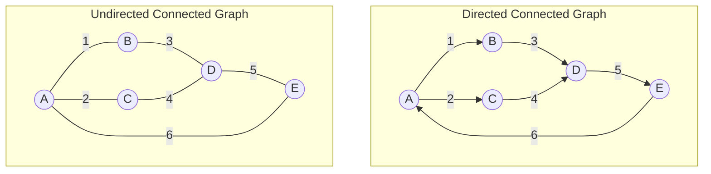
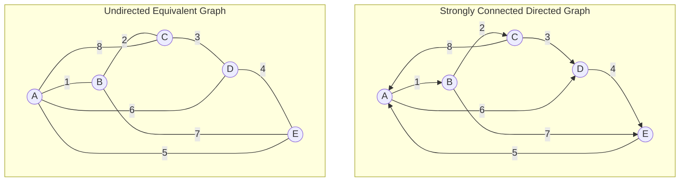

Great resource:
https://courses.cs.washington.edu/courses/cse373/20su/
## **Familiar Graphs**

You are undoubtedly familiar with graphs. 
Here are some common examples:
- line graphs,
- bar graphs,
- pie charts,
- etc.…

The following figure is a simple line graph. This is an example of a type of graph.
It is a set of **points** that are joined by **lines**.

Clearly, graphs provide a way to illustrate data, and the **relationships** among data items.

___
## **Graph**

A graph **_G = (V, E)_** is defined by two sets:

1. V = a set of **vertices**
   |V| = size of V (also called n)
   
2. E = a set of **edges**
   |E| = size of E (also called m)
##### **Graph Example**
![[Pasted image 20240917162847.png]]
V = {a,b,c,d}
E = {(a,c), (b,c), (b,d), (c,d)}
G = {V, E}
##### **Vertex**
The set **_V_** inside of a graph, **_G = (V, E)_**, is defined by a **set of unique vertices** (nodes).
##### **Edge**
The set **_E_** inside of a graph, **_G = (V, E)_**, is defined by a set of **pairs of vertices**.

A pair of vertices can be represented like **(_v_, _w_)**, where **(_v_, _w_) ∈ _V_**.
- The symbol ∈ indicates set membership and means “is an element of”.
- The statement (_v_, _w_) ∈ _V_ means both vertices in the pair _v_, _w_ are in the set _V_.

Two vertices are **_neighbors_** or **_adjacent_** if they are connected by an edge (share an edge).

Edges can be labeled (weighted) or unlabeled (unweighted).

![[Pasted image 20241004135150.png]]

If the graph contains an edge (_v_, _v_) from a vertex to itself, then the path _v_, _v_ is sometimes referred to as a **loop**.

![[Pasted image 20241004135521.png]]

___
## **Path**
A **_path_** ***P***, is a **sequence of edges** that can be followed from vertex **_a_** to **_b_**. 
We start from **_a_**, followed by 0 or more edges, until we reach the target node, **_b_**. 

The path ***P*** from nodes ***a*** to ***b*** can be defined by
1. The **edges** taken from ***a*** to ***b***
2. The **vertices** visited **{v1, v2, v3, ..., vN}** such that
	(vi, vi+1) ∈ _E_ for 0 ≤ _i_ < _N_

Note that there can be **multiple possible paths** between any two nodes.

The **_path_** **_length_** is the **number of vertices or edges traversed on the path**.
- For an unweighted graph, find the shortest path (fewest edges required).

The **_path_** **_weight_** is the **sum of the weights of the edges traversed on the path**.
- For a weighted graph, find the shortest path (using edge weights).
##### **Path Example**
![[Pasted image 20240917163413.png]]

1. List two possible paths from **V to Z:**
	P = {b, h} (edges)
	or 
	P = {V, X, Z} (vertices)
	… (there are more possible paths)

2. **List two possible paths from U to Y:**
	P = {c, f} 
	or 
	P = {a, b, g} 
	… (there are more possible paths)
	
	P = {U, W, Y} 
	or 
	P = {U, V, X, Y} 
	… (there are more possible paths)

3. **Are V and X adjacent nodes?**
	Yes

4. **Are Y and Z adjacent nodes?**
	No
##### **Simple Path**
A **_simple path_ repeats no vertices** (except the 1st vertex can be the same as the last).

![[Pasted image 20240917163745.png]]

P (Seattle->Seattle) = {Seattle, Salt Lake City, San Francisco, Dallas, Chicago, Seattle}
P (Seattle -> Chicago) = {Seattle, Salt Lake City, San Francisco, Dallas, Chicago}
##### **Cycle**
A **_cycle_** is a path that **starts and ends at the same vertex**.

P (Seattle->Seattle) = {Seattle, Salt Lake City, San Francisco, Dallas, Chicago, Seattle}

A **_simple cycle_** is a cycle that does not repeat edges or vertices, except the **first is also the last**.
##### **Acyclic Graph**
A graph with no cycles is called an **Acyclic Graph**.

P (Seattle -> Chicago) = {Seattle, Salt Lake City, San Francisco, Dallas, Chicago}

A directed graph with no cycles is called a **Directed** **Acyclic Graph**.
An undirected graph with no cycles is called an **Undirected** **Acyclic Graph**.
##### **Reachable Node**
Vertex **_a_** is _reachable_ from **_b_** if a **path exists** from **_a_** to **_b_**.

___
## **Degree**
The degree of a vertex is the number of edges touching it.
Each vertex has a separate
1. **In-degree**: Number of incoming edges
2. **Out-degree**: Number of outgoing edges

___
## **Graph Classifications**
There are many different types of graphs. 
Commonly, graphs fall into the following categories:

1. Directed or Undirected
2. Reachable, Connected, Unconnected, or Complete
3. Weighted or Unweighted
4. Cyclic or Acyclic

Choose the kinds required for problem and determined by data
## **Directed Graphs**

##### **Directed Graph Definition**
Edges are a **_one-way_** connection between vertices _v_ -> _w_.

Vertex _w_ is **adjacent** to _v_ if and only if (_v_, _w_) ∈ _E_.
- _w_ is adjacent to _v_, but _v_ is not adjacent to _w_.

In a digraph (directed graph), an edge is an ordered pair
- Thus: (u,v) and (v,u) are not the same edge
##### **Directed Graph Diagram**
A Directed Edge from v -> w is drawn with an arrow
A Directed Edge can only be traversed in the direction of the arrow

**Example:**
The set of edges E = {
	(A,B), 
	(A,C), 
	(A,D), 
	(B,C), 
	(D,C)
}

(A,B) ∈ E and (D,C) ∈ E, but (C,D) ∉ E
Note: A node can have an edge to itself, so (A,A) could be valid

---
## **Undirected Graphs**

##### **Undirected Graph Definition**
Each edge can be traversed in either direction _v_ -> _w_ or _w_ <- _v_.

An undirected graph with edge (_v_, _w_) also has edge (_w_, _v_).
- Vertex _w_ is **adjacent** to _v_ if and only if (_v_, _w_) ∈ _E_.
- _w_ is adjacent to _v_ and _v_ is adjacent to _w_.

##### **Undirected Graph Diagram**
Edges have no direction, so there are no arrows
We can traverse an edge in either direction

**Example:**
E = {
	(A,B), (A,C), (A,D),
	(B,A), (B,D),
	(C,A), (C, D),   
	(D,A), (D,B), (D,C),  
 }

A is adjacent to B and B is adjacent to A
If (A,B) ∈ E then (B,A) ∈ E

---
## **Weighted and Unweighted**

Graphs can be classified by whether or not their edges have weights.

**Weighted Graphs**
Weighted Graphs have edges have an associated cost (weight) that show the cost of traversing the edge.

Example: weights are distances between cities

**Unweighted Graphs**
Unweighted Graphs have edges can be thought of as having equal weight (e.g., all 0, all 1, etc.). Edges simply show connections.

Example: flight map between airports

---
## **Connected and Complete**

##### **Connected Graphs**
A graph is **connected** if every vertex is **reachable** from any other vertex.
You could also phrase it as 'if you can reach any other vertex from the current one'.

This means each pair of **_distinct vertices_ _has a path_** **between them**.
In a connected graph, you can get from any vertex to any other vertex by following this path.

##### **Strongly Connected Directed Graph**
A **directed** graph is **strongly connected** if there is a directed path from every vertex to every other vertex.

Example 1: Strongly Connected

##### **Weakly Connected Directed Graph**
If a directed graph is not strongly connected, but the underlying graph works as an undirected graph, then the graph is said to be **weakly connected**.
##### **Disconnected Graphs**
A **disconnected graph** is a graph in which there are **any** **two vertices that do not have a connecting path** between them.
##### **Complete Graphs**
In a **complete graph**, each pair of distinct vertices has an edge between them.
This means that all vertices **have** **an edge with every other vertex in the graph**.
A **complete graph is also connected**, but the reverse is not true.

---
## **Loops and Cycles**

##### Cycle 
A **cycle** is a path that begins and ends at the same node.
##### Acyclic Graph 
An acyclic graph that does not contain any cycles
##### Loop
A vertex that has an edge with itself is a loop.
Note: many graphs don’t allow loops.

---
## **Linked Lists and Trees**

##### Linked List
A **linked list** is just a graph with some restrictions:
1. Directed
2. Acyclic

Each node has an in and out degree of at most 1.

##### Binary Tree
A **binary tree** is a graph with some restrictions:
1. Directed
2. Acyclic

Binary Trees are known as DAG's (directed acyclic graphs) with the added constraint that each node has an in-degree and out-degree of at most 2.

There is exactly one path from the root to every other node in the tree.

